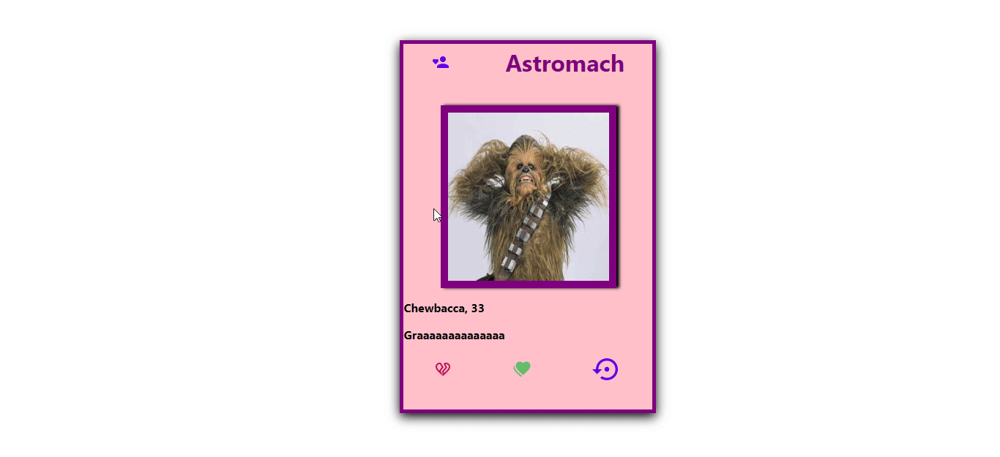

# **Astromach**




## Descrição do Projeto

<p align="justify"> <strong>Astromach<strong> é um clone do Tinder e foi utilizado uma API especifica para o projeto.</p>

<hr>

### Dar matches

Na tela principal o usuário é capaz de dar matche ou não no perfil que aparece.

### Resetar os matches

## É possível resetar todos os matches dados.

<hr>

## Linguagens e libs utilizadas

- [React](https://pt-br.reactjs.org/docs/getting-started.html)
- [Axios](https://www.digitalocean.com/community/tutorials/react-axios-react)
- [Styled-Components](https://styled-components.com/)

## Como baixar o projeto

```bash
# Clonar o projeto

$ git clone https://github.com/Luiz326/astromach.git

# Entrar no diretório
$ cd astromach

# Instalar as dependências

npm install

# Iniciar o projeto

npm start

```
